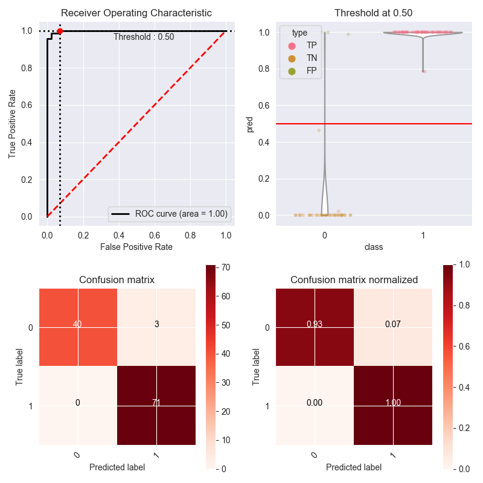
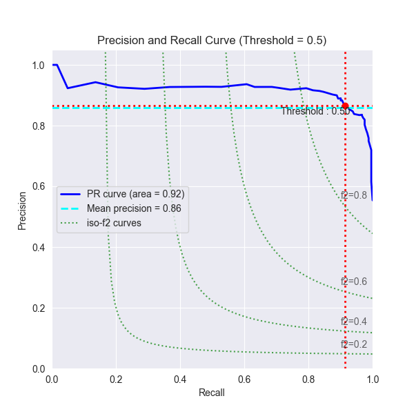

plot_metric
===========

|PyPI-Versions| |doc_badge|

Librairie to simplify plotting of metric like ROC curve, confusion matrix etc..

Installation
------------
Using pip :

.. code:: sh

    pip install plot-metric

Example BinaryClassification
-------

Simple binary classification
~~~~~~~~~~~~~~~~~~~~~~~~~~~~

Let's load a simple dataset and make a train & test set :

.. code:: python

    from sklearn.datasets import make_classification
    from sklearn.model_selection import train_test_split
    
    X, y = make_classification(n_samples=1000, n_classes=2, weights=[1,1], random_state=1)
    X_train, X_test, y_train, y_test = train_test_split(X, y, test_size=0.5, random_state=2)

Train our classifier and predict our test set :

.. code:: python

    from sklearn.ensemble import RandomForestClassifier
    
    clf = RandomForestClassifier(n_estimators=50, random_state=23)
    model = clf.fit(X_train, y_train)

    # Use predict_proba to predict probability of the class
    y_pred = clf.predict_proba(X_test)[:,1]

We can now use ``plot_metric`` to plot ROC Curve, distribution class and classification matrix :

.. code:: python

    # Visualisation with plot_metric
    bc = BinaryClassification(y_test, y_pred, labels=["Class 1", "Class 2"])

    # Figures
    plt.figure(figsize=(15,10))
    plt.subplot2grid(shape=(2,6), loc=(0,0), colspan=2)
    bc.plot_roc_curve()
    plt.subplot2grid((2,6), (0,2), colspan=2)
    bc.plot_precision_recall_curve()
    plt.subplot2grid((2,6), (0,4), colspan=2)
    bc.plot_class_distribution()
    plt.subplot2grid((2,6), (1,1), colspan=2)
    bc.plot_confusion_matrix()
    plt.subplot2grid((2,6), (1,3), colspan=2)
    bc.plot_confusion_matrix(normalize=True)
    plt.show()
    bc.print_report()

    >>>                    ________________________
    >>>                   |  Classification Report |
    >>>                    ‾‾‾‾‾‾‾‾‾‾‾‾‾‾‾‾‾‾‾‾‾‾‾‾
    >>>               precision    recall  f1-score   support
    >>>            0       1.00      0.93      0.96        43
    >>>            1       0.96      1.00      0.98        71
    >>>    micro avg       0.97      0.97      0.97       114
    >>>    macro avg       0.98      0.97      0.97       114
    >>> weighted avg       0.97      0.97      0.97       114

Custom parameters
~~~~~~~~~~~~~~~~~

It is possible to customize a lot of figures parameters. You can find all parameters with documentation on the official package documentation : https://plot-metric.readthedocs.io/en/latest/
Or you can retrieve a python dictionnary with all available parameters with the following :

.. code:: python

    # Use the function get_function_parameters(function) to get parameters
    bc.get_function_parameters(bc.plot_roc_curve)

    >>> {'threshold': None,
        'plot_threshold': True,
        'beta': 1,
        'linewidth': 2,
        'fscore_iso': [0.2, 0.4, 0.6, 0.8],
        'iso_alpha': 0.7,
        'y_text_margin': 0.03,
        'x_text_margin': 0.2,
        'c_pr_curve': 'black',
        'c_mean_prec': 'red',
        'c_thresh': 'black',
        'c_f1_iso': 'grey',
        'c_thresh_point': 'red',
        'ls_pr_curve': '-',
        'ls_mean_prec': '--',
        'ls_thresh': ':',
        'ls_fscore_iso': ':',
        'marker_pr_curve': None}
    
From a custom dictionnary you can set all parameters you want and plot a figures :

.. code:: python

    # Example custom param using dictionnary
    param_pr_plot = {
        'c_pr_curve':'blue',
        'c_mean_prec':'cyan',
        'c_thresh_lines':'red',
        'c_f1_iso':'green',
        'beta': 2,
    }

    plt.figure(figsize=(6,6))
    bc.plot_precision_recall_curve(**param_pr_plot)
    plt.show()

.. |PyPI-Versions| image:: https://img.shields.io/badge/plot__metric-v0.0.6-blue.svg
    :target: https://pypi.org/project/plot-metric/

.. |doc_badge| image:: https://readthedocs.org/projects/plot-metric/badge/?version=latest
    :target: https://plot-metric.readthedocs.io/en/latest/?badge=latest
    :alt: Documentation Status
